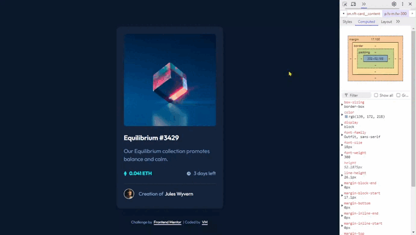

# Frontend Mentor - NFT preview card component solution

This is a solution to the [NFT preview card component challenge on Frontend Mentor](https://www.frontendmentor.io/challenges/nft-preview-card-component-SbdUL_w0U). Frontend Mentor challenges help you improve your coding skills by building realistic projects. 

## Table of contents

◼️ [The challenge](#the-challenge-muscle)

◼️ [Screenshots](#screenshots-camera)

◼️ [Links](#links-link)

◼️ [Built with](#built-with-hammer_and_pick)

◼️ [Author](#author-beginner)

## The challenge :muscle:

Users should be able to:

🎯 View the optimal layout depending on their device's screen size

🎯 See hover states for interactive elements

## Screenshots :camera:

### Links :link:

<!-- [Solution in Frontend Mentor]() 👈 -->

[Live site URL here](https://mendezpvi.github.io/fem-nft-preview-card-component) 👈

## Built with :hammer_and_pick:

📌 Semantic HTML5 markup

📌 CSS custom properties

📌 Utility classes

📌 Flexbox

📌 CSS Grid

📌 Mobile-first workflow

## Author :beginner:

✨ Frontend Mentor - [@mendezpvi](https://www.frontendmentor.io/profile/mendezpvi)

✨ X-Twitter - [@mendezpvi](https://x.com/mendezpvi)